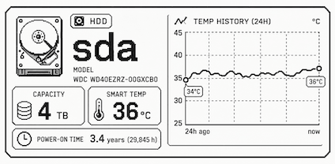

# E-Paper Monitor

ESP32 固件：从 [Scrutiny](https://github.com/AnalogJ/scrutiny) 拉取硬盘健康数据，在 2.13" 墨水屏（SSD1675A / GDEH0213B72）上以卡片轮播展示，并提供一个现代化的 Web 仪表盘。

- **平台**：ESP32-WROOM-32（`nodemcu-32s`）+ ESP-IDF（PlatformIO）
- **屏幕**：2.13" 黑白墨水屏，控制器分辨率 250×122，可视安全区约 212×104
- **数据源**：Scrutiny `/api/summary`

## 功能



- **墨水屏轮播**：逐块展示硬盘（图标 / 设备名 / 型号 / 容量 / 温度 / 通电时长），整轮结束后插入一页 WiFi/IP 信息页。
- **省电刷新策略**：单页停留较长时间再切换，并采用全刷/局刷预算（`PARTIAL_REFRESH_BUDGET`）控制刷新方式。
- **状态一致性**：启动时先拉取一次状态，再展示带 `Status: OK / FAILED` 的信息页，与轮播保持一致；数据过期或连续拉取失败会显示 `STALE` 角标。
- **Web 仪表盘**：现代化卡片式响应布局，客户端 JS 定时拉取 `/api/disks` 并渲染（详见下文）。
- **看门狗**：墨水屏连续刷新失败达到阈值时自动重启。

## 接线 / Wiring

### ESP32-WROOM-32

| 墨水屏驱动板 | 功能       | ESP32-WROOM-32 | 说明                |
| ------ | -------- | -------------: | ----------------- |
| GND    | 电源地      |            GND | 必须共地              |
| 3V3    | 3.3V 电源  |            3V3 | 不建议接 VIN/5V       |
| SCK    | SPI 时钟   |         GPIO18 | ESP32 默认 VSPI SCK |
| SDA    | SPI MOSI |         GPIO23 | 不是 I²C SDA        |
| RST    | 屏幕复位     |         GPIO25 | 普通输出引脚            |
| DC     | 数据/命令选择  |         GPIO26 | 普通输出引脚            |
| CS1    | SPI 片选   |         GPIO27 | 单芯片屏使用 CS1        |
| BUSY   | 屏幕忙信号    |         GPIO33 | ESP32 输入          |
| CS2    | 第二片选     |            不连接 | 2.13 寸单芯片屏通常不用    |

```
墨水屏驱动板        ESP32 DevKit

GND      --------> GND
3V3      --------> 3V3
SCK      --------> GPIO18
SDA      --------> GPIO23
RST      --------> GPIO25
DC       --------> GPIO26
CS       --------> GPIO27
BUSY     --------> GPIO33
```

> 引脚可在 `include/config.h` 中通过 `EPD_PIN_*` 覆盖。

## 配置

所有可调项集中在 `include/config.h`，并可通过 `platformio.ini` 的 `build_flags` 覆盖（`-D` 优先级高于 `config.h` 默认值）。

| 配置项 | 说明 | config.h 默认 |
| --- | --- | --- |
| `WIFI_SSID` / `WIFI_PASS` | WiFi 凭据 | 占位值 |
| `SCRUTINY_API_BASE` | Scrutiny API 基址（不带末尾 `/`） | `http://192.168.66.2:8085/api` |
| `DISPLAY_PER_DISK_SECONDS` | 墨水屏单页停留秒数 | `30` |
| `FETCH_INTERVAL_SEC` | 拉取间隔秒数（轮播累计超过该时长后重新拉取） | `3600` |
| `HTTP_FETCH_TIMEOUT_MS` | HTTP 拉取超时 | `10000` |
| `MAX_DISKS` | 最大硬盘数 | `16` |
| `PARTIAL_REFRESH_BUDGET` | 连续局刷次数上限（到达后强制全刷） | `20` |
| `FETCH_FAIL_STALE_THRESHOLD` | 连续拉取失败多少次后标记 `STALE` | `5` |
| `HTTP_SERVER_PORT` | Web 服务端口 | `80` |

> 当前 `platformio.ini` 的 `build_flags` 覆盖了部分默认值（含 WiFi/Scrutiny 真实地址）。如需把凭据移出版本库，可改用 git-ignored 的 `secrets.ini` 并通过 `${secret.*}` 插值。

## 构建与烧录

```bash
# 编译
pio run

# 烧录
pio run -t upload

# 串口监视（115200）
pio device monitor
```

> 若 `pio` 不在 PATH，可使用 `~/.platformio/penv/bin/pio`。

## Web 仪表盘

设备联网后访问其 IP（默认 80 端口），即可看到现代化卡片式仪表盘：

- 顶部 header 显示 SSID / IP / 固件版本 / 盘数 / 上次更新时间，右侧为 `LIVE` / `STALE` / `OFFLINE` 状态药丸。
- 每块硬盘一张卡片：存储类型图标（NVMe / HDD 自动切换）、设备名、型号与序列号、`CAPACITY` 与 `SMART TEMP` 指标块、`POWER-ON TIME`，以及 `device_status` 与坏扇区计数（异常红色高亮）。
- 客户端 JS 每 15 秒自动刷新；布局自适应，窄屏下指标块改为单列。

### HTTP 接口

| 路径 | 说明 |
| --- | --- |
| `GET /` | 卡片式仪表盘 HTML |
| `GET /api/disks` | 硬盘列表与拉取状态的 JSON |
| `GET /healthz` | 健康检查 JSON（状态、盘数、运行时长、连续失败次数） |

`/api/disks` 返回示例（字段）：`last_fetch_ts`、`uptime_s`、`consec_fetch_fail`，以及 `disks[]`（`device_name`、`device_type`、`model_name`、`serial_number`、`capacity_label`、`capacity_bytes`、`temp`、`power_on_hours`、`device_status`、`realloc`、`pending`、`uncorrectable`、`health`）。

## 任务结构

- `app_main`：启动编排（WiFi → 首次拉取 → 信息页 → 拉起后台任务）。
- `fetch_task`：被通知时执行一次 Scrutiny 拉取。
- `display_task`：墨水屏轮播 + 信息页 + 到期触发拉取。
- `esp_http_server` 内部任务：Web 仪表盘。

## 相关文件

- `src/main.cpp` — 启动编排与任务循环
- `src/display.cpp` — 墨水屏页面渲染与全/局刷策略
- `src/web_server.cpp` — HTTP 服务与 Web UI
- `src/scrutiny_fetch.cpp` — Scrutiny 拉取与解析
- `include/config.h` — 集中配置
- `EPAPER_UI_NOTES.md` — 墨水屏布局与坐标说明
