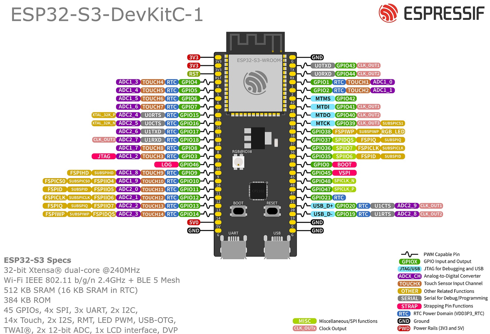

# pinout

## ESP32-S3-DevKitC-1 (esp32-s3-devkitc-1)



墨水屏走 SPI 总线，GPIO 集中在左侧下半区 GPIO9–GPIO14

| 墨水屏驱动板 | 功能       | ESP32-S3-DevKitC-1 | 说明                       |
| ------ | -------- | -----------------: | ------------------------ |
| GND    | 电源地      |                GND | 必须共地                     |
| 3V3    | 3.3V 电源  |                3V3 | 不建议接 VIN/5V               |
| SCK    | SPI 时钟   |             GPIO12 | 对应 FSPICLK，适合作 SPI SCK   |
| SDA    | SPI MOSI |             GPIO11 | 对应 FSPID，注意不是 I²C SDA    |
| RST    | 屏幕复位     |             GPIO14 | 普通输出引脚                   |
| DC     | 数据/命令选择  |              GPIO9 | 普通输出引脚                   |
| CS    | SPI 片选   |             GPIO10 | 对应 FSPICS0               |
| BUSY   | 屏幕忙信号    |             GPIO3 | 普通输入引脚                   |

```
墨水屏驱动板        ESP32-S3-DevKitC-1

GND      --------> GND
3V3      --------> 3V3
SCK      --------> GPIO12
SDA      --------> GPIO11
RST      --------> GPIO14
DC       --------> GPIO9
CS / CS1 --------> GPIO10
BUSY     --------> GPIO3
CS2      --------> 不连接
```

固件用驱动板侧命名定义引脚（SCK/SDA/RST/DC/CS/BUSY，其中 SDA 即 SPI MOSI），
可通过 `-DEPD_PIN_*` 编译参数覆盖；S3 上 SCK/SDA/CS 落在 FSPI IOMUX 引脚，
因此 SPI 走 `SPI2_HOST`（FSPI）：

```cpp
#define EPD_PIN_SCK   12
#define EPD_PIN_SDA   11   // SPI MOSI / 串行数据线
#define EPD_PIN_CS    10
#define EPD_PIN_DC     9
#define EPD_PIN_RST   14
#define EPD_PIN_BUSY   3
#define EPD_SPI_HOST  SPI2_HOST
```

## ESP32-WROOM-32 (nodemcu-32s)


| 墨水屏驱动板 | 功能       | ESP32-WROOM-32 | 说明                |
| ------ | -------- | -------------: | ----------------- |
| SCK    | SPI 时钟   |         GPIO18 | ESP32 默认 VSPI SCK |
| SDA    | SPI MOSI |         GPIO23 | 不是 I²C SDA        |
| RST    | 屏幕复位     |         GPIO25 | 普通输出引脚            |
| DC     | 数据/命令选择  |         GPIO26 | 普通输出引脚            |
| CS     | SPI 片选   |         GPIO27 | 单芯片屏使用 CS1        |
| BUSY   | 屏幕忙信号    |         GPIO33 | ESP32 输入          |

```
墨水屏驱动板        ESP32 DevKit

GND      --------> GND
3V3      --------> 3V3
SCK      --------> GPIO18
SDA      --------> GPIO23
RST      --------> GPIO25
DC       --------> GPIO26
CS       --------> GPIO27
BUSY     --------> GPIO33
```